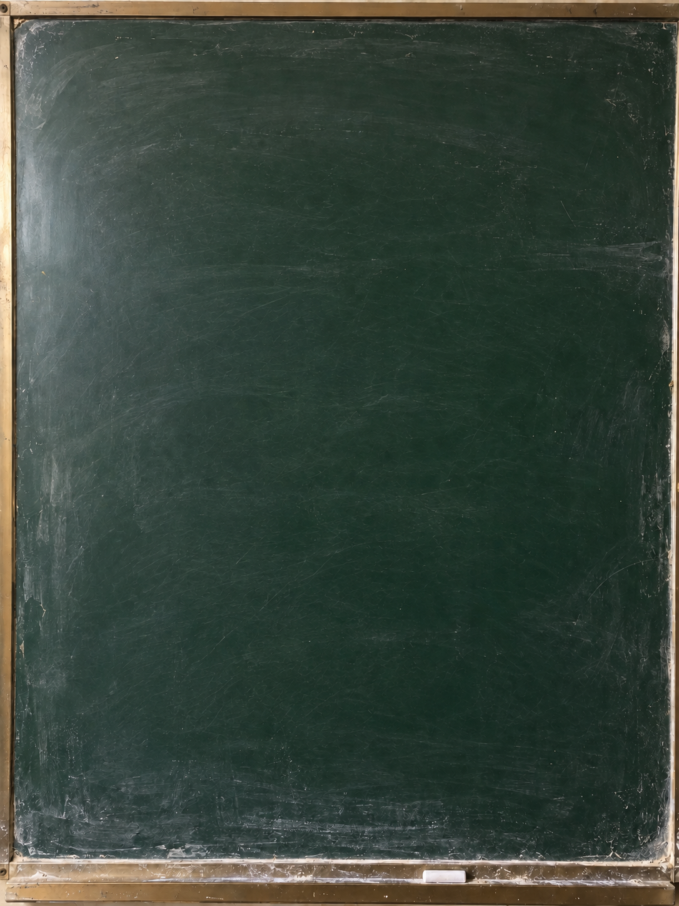

# 黑板图片生成器

一个纯前端小工具：**固定一张去字的黑板背景，在浏览器里输入文字，一键导出 PNG**。

不需要安装、不需要联网、没有后端、不调用任何 API——所有绘制都在本地 `<canvas>` 完成。

## 快速开始

双击 `黑板图片生成器.html`，用浏览器打开即可。

1. 左侧文本框输入文字，**回车另起一行**，长句会自动折行
2. 调好参数，点「下载 PNG 图片」

## 可调参数

| 参数 | 说明 |
| --- | --- |
| 字体 | 默认行楷 / 楷体，可选楷体、宋体 |
| 字号上限 | 35–180，文字按行数和长度自动缩放，不超过该上限 |
| 行距 | 115–200（百分比） |
| 粉笔颗粒 | 0–65，模拟粉笔笔触的粗糙感 |
| 导入手写字体 | 可选，支持 `.ttf` / `.otf` / `.woff` / `.woff2`，只在本机生效、不上传 |

## 文件说明

| 文件 | 作用 |
| --- | --- |
| `黑板图片生成器.html` | 单文件应用，HTML / CSS / JS 和背景图全部内嵌（背景以 base64 打包） |
| `固定黑板背景.png` | 同一张背景的独立副本，方便你自己替换成别的黑板 |
| `使用说明.txt` | 原始使用说明 |

## 关于字体

默认调用系统自带的行楷 / 楷体（macOS 上是 STXingkai、STKaiti，Windows 上是 KaiTi），**效果跟 AI 自由手写不是一回事**。想要更接近手写的效果，用「导入自己的手写字体」载入一个手写字体文件即可。

## 关于背景

背景是从一张带字的黑板照片上去字生成的，去字区域的纹理属于重建结果，因此每次出图都使用同一张固定背景，保证成图风格一致。

生成背景时使用的提示词（供参考）：

> Remove all five lines of Chinese handwriting; fill with continuous green chalkboard texture; preserve frame, chalk ledge, lighting and worn edges.

## 二次开发

完整 JavaScript 就在 HTML 里，用文本编辑器打开直接改。想换背景，把新图片转成 base64 替换掉脚本里那一长串字符串即可。

## License

MIT
